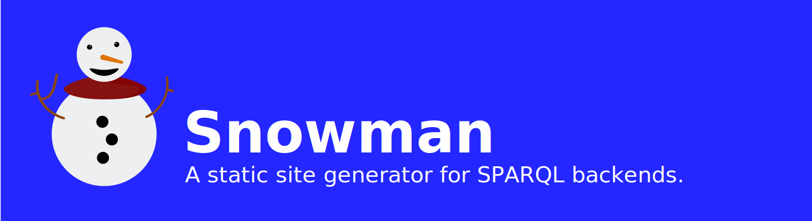

 [](https://codeclimate.com/github/glaciers-in-archives/snowman/maintainability) 

Snowman is designed to allow RDF-based projects to use SPARQL in the user-facing parts of their stack, even at scale. Snowman powers projects rendering simple SKOS vocabularies as well as projects rendering entire knowledge bases. Snowman's templating system comes with RDF- and SPARQL-tailored functions, and features and takes its data from SPARQL queries.

## Installation

[Download the latest release for your OS/architecture](https://github.com/glaciers-in-archives/snowman/releases).

If your OS/architecture combination is not available, you will need to build Snowman from source:

```bash
git clone https://github.com/glaciers-in-archives/snowman
cd snowman
go build -o snowman
```

### Installation on macOS
On macOS you might get a message that "Apple could not verify “snowman” is free of malware that may harm your Mac or compromise your privacy.". To get around this message go to System Settings, then Privacy & Security, scroll all the way down to 'Security' and click 'Allow Anyway' next to the message that snowman was "blocked to protect your mac". After that you can run snowman, but you still need to click the 'Open Anyway' button on the following pop-up and enter your password / touchid.

## Usage

Running `snowman new  --directory="my-project-name"` will scaffold a new project utilising the most common Snowman features.

To go from there checkout the [Snowman Manual](https://byabbe.se/snowman-manual/) or the `examples` directory.

## Development

Snowman is written in Go. To build Snowman from source, you need to have Go installed. Clone the repository and build the binary:

```bash
git clone https://github.com/glaciers-in-archives/snowman
cd snowman
go build -o snowman
```

To run the tests, use the foollowing command:

```bash
go test ./...
```

To make a release, see `RELEASE.md`.

## Building the documentation

The documentation is built using [mdBook](https://rust-lang.github.io/mdBook/). To build the documentation, run the following command:

```bash
cd docs && mdbook serve
```

## License

Copyright (c) 2020- Albin Larsson & contributors. Snowman is made available under the GNU Lesser General Public License.
