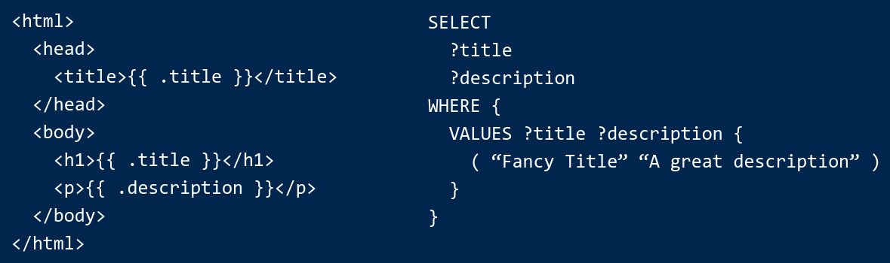

# Introduction

**Snowman is a static site generator for SPARQL backends.**

Snowman's templating system comes with RDF- and SPARQL-tailored features and takes its data from SPARQL queries. Snowman has first-class support for RDF concepts like: Language-tagged literals, IRIs, and XSD datatypes.

## Jump right in

 - [Installation](./installation.md)
 - [Quick start](./quick-start.md)

## Background

Ever seen a project that models its data in RDF, but then uses a non-RDF technology to render it?

Snowman is designed to address this by allow RDF-based projects to use SPARQL in the user-facing parts of their stack, without sacrificing preformance. Today, Snowman is used to render everything from simple SKOS vocabularies to entire knowledge bases.

Snowman is not a high-level web-framework, actually, turns out people use it for a lot of things like data transformation and APIs! As a result, Snowman is rather unopinionated about how you structure your project, transforming data directly in SPARQL queries? or with the template engine? or both? It's up to you, that said, we have a [style guide and some best practices](./reference/style-guide.md) to help you get started.
